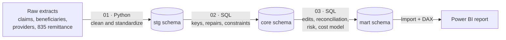

# Medicare Claims Payment Integrity Analytics

**Reviewing every claim by hand was costing $425K and still letting bad claims through. Ten rule-based prepayment edits cut that cost by 72% and sent 96% of claims through without manual review.**


> **Data note:** All claims, patients and providers are synthetic. File layouts follow real CMS formats (DE-SynPUF, NPPES, X12 835), and volumes, charges and denial rates are calibrated to CMS 2023 Physician/Supplier Procedure Summary data. No real patient or provider information is used.

---

## The Problem

A Medicare Part B payment integrity team decided **23,631 professional claims** between January 2025 and June 2026. Every claim went through manual review, whatever its risk:

* **Reviewers spent most of their time on clean claims.** 93% of claims were paid in the end, yet each one still waited in the same review queue.
* **Every manual review cost $18 in staff time.** Reviewing every claim cost **$425,358** over 18 months.
* **A wrong approval cost far more than a review:** the amount paid, plus about $250 in rework and recovery.
* **Bad claims still got paid.** With an overloaded queue, **99 claims that broke a billing rule were paid anyway**: units over the daily limit, screening diagnoses on diagnostic services, duplicates.
* **Denials were rising and no one knew why.** The denial rate held at 5.8% to 6.8% through 2025, then jumped to **8.2% in both 2026 quarters**.
* **Provider outreach was unfocused.** The team had no way to rank which practices were causing most of the billing errors.

### What leadership needed to decide

| # | Business question | Decision it supports |
|---|---|---|
| 1 | Are denials rising, and what is driving them? | Where to focus edits and provider education |
| 2 | Can simple rules catch bad claims **before** payment? | Whether rules can be trusted to screen claims |
| 3 | Which rules are safe to auto-deny, and which need a reviewer? | Hard edit vs. soft edit |
| 4 | Which paid claims should we try to recover? | Post-payment recovery worklist |
| 5 | Which providers should we contact first? | Targeted Probe and Educate (TPE) selection |
| 6 | Do the rules save money compared with reviewing everything? | Review operating model |

---

## Results at a Glance

| | Before: review every claim | After: rule-based routing |
|---|---:|---:|
| Claims sent to manual review | 23,631 | **854** |
| Claims processed without manual review | 0 | **22,777 (96%)** |
| Claims auto-denied by high-accuracy edits | 0 | **631** |
| Total decision cost* | $425,358 | **$120,274** |
| Agreement with the payer's final decision | n/a | **98.3%** |

**Net savings: $305,084 (72%).** Rules stay cheaper than full review until a missed improper claim costs more than **$1,281** in rework and recovery.

<sub>*Scenario assumptions: $18 per manual review, $0.35 per automated claim, and the amount paid plus $250 for each improper claim the edits miss. The what-if inputs in the Power BI report let you change all three.</sub>

---

## Key Findings

### 1. Denials are rising, led by physical therapy


* Denial rate rose from **5.8% to 6.8%** per quarter in 2025 to **8.2%** in 2026 Q1 and Q2 (6.9% overall, $138,140 denied).
* **97110 Therapeutic exercise** has the highest denial rate at **11.6%**, more than twice the rate of office visits.
* Missing information and medical necessity account for **half of all denials**. Both point to incomplete claims or documentation.
* 7 of 8 denial reasons increased in 2026. Provider enrollment denials nearly tripled.

**Recommendation:** Prioritize therapy claims for review and add a provider enrollment date check at claim intake.

### 2. Ten prepayment edits catch 82% of improper claims


Each edit is built in SQL from a published Medicare billing rule and mapped to the payer denial reason (CARC) it mirrors.

| Edit | Rule | Mirrors CARC |
|---|---|---|
| No Part B coverage | Service date outside the patient's Part B coverage | 24, 26, 27 |
| Service after death | Service date after the patient's date of death | 27 |
| Provider not enrolled | Service date outside the provider's Medicare enrollment | B7 |
| Late filing | Claim received more than 1 year after service | 29 |
| Units over daily limit | Units above the fee schedule's daily maximum (MUE style) | 151 |
| Missing referring provider | Lab or therapy claim with no referring NPI | 16 |
| Missing diagnosis | No ICD-10-CM code | 16 |
| Wrong modifier | Therapy without GP, or GP/59 on a non-therapy code | 4 |
| Screening dx on diagnostic | Screening diagnosis (Z00, Z13) or a diagnosis that does not support therapy | 50 |
| Duplicate claim | Same patient, provider, code, date, units and modifier already billed | 18 |

* The edits flagged **1,485 claims**. The payer also refused **1,386** of them (**93.3% accuracy**), and they caught **82% of the 1,682 refused claims**.
* **6 edits are 98%+ accurate** and can auto-deny (631 claims). **4 edits** at 84.9% to 92.9% route to a reviewer (854 claims).
* The **296 missed claims** are almost all medical necessity (151) or missing information (144). These need medical records, which claim data cannot show. More edits will not close this gap.

**Recommendation:** Deploy 6 hard edits and 4 soft edits. Tighten the screening diagnosis code list, the weakest rule with 49 false flags.

### 3. A few providers drive most of the errors


* The **top 25% of providers (30)** account for **63% of flagged claims** (936 claims).
* **Physical therapists** have the highest flag rate at **10.6%**, 1.9 times Internal Medicine (5.5%).
* **99 paid claims ($7,088)** fail at least one edit. They form the post-payment recovery worklist, ranked by dollars at risk.

**Recommendation:** Start TPE outreach with the high-risk group. Confirm high flag rates on low-volume providers with a claim sample first.

---

## Recommendations

| Priority | Action | Expected impact |
|---|---|---|
| 1 | Move to rule-based routing: 6 hard edits auto-deny, 4 soft edits go to a reviewer | 96% of claims skip manual review; $305K (72%) lower decision cost |
| 2 | Keep medical-record review for medical necessity and missing information claims | Covers the 296 denials edits cannot detect |
| 3 | Work the recovery worklist, starting with over-unit claims | Up to $7,088 in paid claims at risk |
| 4 | Focus provider education on the top 30 providers and physical therapy | Reaches 63% of flagged claims |
| 5 | Add an enrollment date check at claim intake | Addresses the fastest-growing denial reason |

---

## How It Was Built



**Design rule:** Python fixes formats, SQL applies all business logic, Power BI only presents.

| Notebook | What it does |
|---|---|
| [`01_data_cleaning.ipynb`](01_data_cleaning.ipynb) | Cleans 10 messy extracts: mixed date formats, renamed columns across years, overlapping quarterly files, duplicate 835 batches, NPI check-digit validation (Luhn). Loads 6 staging tables to PostgreSQL. |
| [`02_core_tables.ipynb`](02_core_tables.ipynb) | Builds trusted `core` tables with one row per entity. Repairs broken patient IDs, NPIs and service dates from the 835 remittance, flags every repair, and adds primary keys, foreign keys, check constraints and indexes. |
| [`03_payment_integrity.ipynb`](03_payment_integrity.ipynb) | Answers the six business questions in SQL: denial trends, 10 prepayment edits, confusion matrix (precision and recall), hard vs. soft edit disposition, recovery worklist, provider risk quartiles, cost model with sensitivity analysis. Builds the `mart` tables. |

### Power BI report

Four stakeholder pages plus drill-through and tooltip pages, built for self-serve analysis:

* **Summary:** four findings, each with a KPI and a button to the detail page
* **Denial Overview:** field parameters for metric and breakdown (16 views), dynamic titles, above-average highlighting, year-over-year comparison by reason
* **Prepayment Edits:** edit recommendation table, edit vs. payer decision matrix, cost comparison with what-if inputs
* **Provider Focus:** risk quartiles, flag rate by specialty, provider contact list with drill-through to the recovery worklist

| Data model (star schema) | Power Query |
|---|---|
|  |  |

Claims fact table with Date (marked date table), Procedures, Providers and Denial Reasons dimensions, plus Claim Edit Results, Failed Edits and Provider Risk. Measures are organized in display folders: Denials, Prepayment Edits, Cost Model, Assumptions, Providers and Recovery.

---

## Repository Structure

```
├── 01_data_cleaning.ipynb          # Python: clean raw extracts, load stg
├── 02_core_tables.ipynb            # SQL: build trusted core tables
├── 03_payment_integrity.ipynb      # SQL: analysis and mart tables
├── medicare_payment_integrity.pbix # Power BI report
├── assets/                         # Report screenshots
├── raw/                            # Source extracts (not committed)
└── reference/                      # Fee schedule, reason codes (not committed)
```

## Limitations

* The data is synthetic, so results show the method, not real Medicare outcomes.
* Scope is five procedure codes (99213, 99214, 80053, 93000, 97110), office setting, single-line claims.
* The payer's decision is the benchmark, and payers also make mistakes, so measured edit accuracy is likely conservative.
* Cost inputs are scenario assumptions, which is why the report includes what-if parameters and the notebook includes sensitivity analysis.
* 349 claims still pending at the cut-off are excluded from denial rates, accuracy and the cost model.

## Industry Context

This is not a hypothetical problem. In FY2025, Medicare Fee-for-Service made an estimated **$28.83 billion in improper payments (6.55%)**, and the Part B rate was 8.4%. About two thirds were tied to missing or insufficient documentation, the same pattern this analysis found in the claims the edits could not catch.

## Sources

* CMS, [Fiscal Year 2025 Improper Payments Fact Sheet](https://www.cms.gov/newsroom/fact-sheets/fiscal-year-2025-improper-payments-fact-sheet)
* CMS, [2025 Medicare FFS Supplemental Improper Payment Data](https://www.cms.gov/files/document/nov-2025-medicare-ffs-supplemental-improper-payment-data-2025922.pdf)
* CMS, [Medicare NCCI Medically Unlikely Edits](https://www.cms.gov/medicare/coding-billing/national-correct-coding-initiative-ncci-edits/medicare-ncci-medically-unlikely-edits-mues)
* CMS, [Targeted Probe and Educate](https://www.cms.gov/Research-Statistics-Data-and-Systems/Monitoring-Programs/Medicare-FFS-Compliance-Programs/Medical-Review/Targeted-Probe-and-EducateTPE.html)
* CMS, [Physician/Supplier Procedure Summary (PSPS)](https://data.cms.gov/summary-statistics-on-use-and-payments/physiciansupplier-procedure-summary)
* X12, [Claim Adjustment Reason Codes](https://x12.org/codes/claim-adjustment-reason-codes)

---

**Thrinesh Vuribindi** · Data Analyst · Microsoft Certified: Fabric Analytics Engineer Associate (DP-600)
