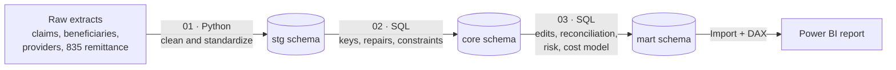

# Medicare Claims Payment Integrity Analytics

**Reviewing every claim by hand was costing $425K and still letting bad claims through. Ten rule-based prepayment edits cut that cost by 72% and sent 96% of claims through without manual review.**

[Notebooks](#how-it-was-built) · [Power BI report](medicare_payment_integrity.pbix) · [Findings](#detailed-findings) · [Recommendations](#recommendations)

---

## Project Overview

| | |
|---|---|
| **Domain** | Healthcare payment integrity: Medicare Part B professional claims |
| **Business problem** | Every claim goes to a reviewer. Clean claims clog the queue while claims that break billing rules still get paid |
| **Who it is for** | Payment integrity, claims operations, provider relations, and finance leadership |
| **Data** | 23,980 synthetic Part B claims (23,631 decided), 2,200 beneficiaries, 120 providers and the payer's X12 835 remittance, January 2025 to June 2026 |
| **Tools** | Python (pandas, SQLAlchemy), PostgreSQL, SQL, Jupyter, Power BI (DAX, Power Query) |
| **Output** | A tested set of 10 prepayment edits, an auto-deny vs. manual review routing plan, a recovery worklist, a provider outreach list, and a 4-page Power BI report |

## Key Findings

| **$425K → $120K** | **96%** | **82%** | **63%** |
|:---:|:---:|:---:|:---:|
| decision cost, review everything vs. rule-based routing (72% lower) | of claims decided without manual review (22,777 of 23,631) | of improper claims caught before payment, with 93.3% edit accuracy | of flagged claims come from the top 25% of providers |

---

## Business Problem

A Medicare claims operation can fail in two directions.

**Pay a claim that breaks a billing rule**, and the money is already gone. Getting it back means a records request, a recovery letter and an appeal window, which costs far more than catching it up front.

**Send every claim to a reviewer** to avoid that, and the review queue becomes the bottleneck. This is where this operation stood. Across 18 months, every one of its 23,631 decided Part B claims went through manual review, regardless of risk:

* **Reviewers spent most of their time on clean claims.** 93 of every 100 claims were paid in the end, yet every one waited in the same queue as the risky ones.
* **Each review cost $18 in staff time**, so reviewing everything cost **$425,358**.
* **A wrong approval cost far more than a review:** the amount paid plus about **$250** in rework and recovery.
* **Bad claims still slipped through.** With reviewers stretched across every claim, **99 claims that broke a billing rule were paid** (units over the daily limit, duplicate billing, screening diagnoses on diagnostic services).
* **Denials were climbing and no one knew why.** The denial rate held at 5.8% to 6.8% through 2025, then jumped to **8.2% in both 2026 quarters**.
* **Provider education was a guess.** There was no way to rank which practices caused most of the billing errors, so outreach could not be targeted.

The goal is not to automate as many claims as possible. It is to find which claims can be decided safely without a reviewer, which ones still need one, and **the point at which automation stops saving money**. Sending a claim to review is not a denial: an unusual claim can still be valid and paid.

## Business Questions

1. Are denials rising, and what is driving them?
2. Can simple rules, using only what is on the claim at arrival, catch bad claims before payment?
3. Which rules are accurate enough to deny automatically, and which need a reviewer?
4. Which already-paid claims should be reviewed for recovery?
5. Which providers should be contacted first?
6. Does rule-based routing save money compared with reviewing every claim, and under what assumptions does that change?

## Stakeholders

| Stakeholder | Decisions Supported |
|---|---|
| Payment integrity team | Which edits to deploy as hard (auto-deny) vs. soft (route to review), and which paid claims to pursue |
| Claims operations | How much review capacity is needed once low-risk claims pass automatically |
| Provider relations | Which providers and specialties to prioritize for Targeted Probe and Educate (TPE) outreach |
| Finance and leadership | Whether the review model saves money, and how sensitive that is to cost assumptions |

---

## Detailed Findings

### 1. Denials are rising, led by physical therapy

| Period | Denial rate |
|---|---:|
| 2025, Q1 to Q4 | 5.8% to 6.8% |
| 2026, Q1 and Q2 | **8.2%** |
| Overall | 6.9% ($138,140 denied) |

* **97110 Therapeutic exercise** is denied at **11.6%**, more than twice the rate of office visits (4.8% to 4.9%).
* **Missing information and medical necessity** make up half of all denials. Both point to incomplete claims or documentation.
* The 2026 rise is broad: **7 of 8 denial reasons increased**, and provider enrollment denials nearly tripled.

### 2. Ten prepayment edits catch 82% of improper claims before payment

| | Payer refused | Payer paid |
|---|---:|---:|
| **Flagged by edits** | 1,386 | 99 |
| **Not flagged** | 296 | 21,850 |

* Edits flag 1,485 claims with **93.3% accuracy** and catch **82% of the 1,682 refused claims**. Overall agreement with the payer is **98.3%**.
* **6 edits are 98% or more accurate** and can deny automatically (631 claims). **4 edits** at 84.9% to 92.9% send claims to a reviewer (854 claims). The other **22,146 claims pass automatically**.
* The **296 missed claims** are almost all medical necessity (151) or missing information (144). Those need medical records, which claim data cannot show, so more edits will not close this gap. This matches CMS findings that about two thirds of FY2025 Medicare improper payments were documentation problems.
* **Cost:** rules cost **$120,274** vs. **$425,358** for full review, saving **$305,084**. They stay cheaper until a missed improper claim costs more than **$1,281** in rework and recovery.

### 3. A small group of providers drives most of the errors

| Provider risk quartile | Share of flagged claims |
|---|---:|
| Q1 (highest risk, 30 providers) | **63.0%** |
| Q2 | 19.3% |
| Q3 | 10.8% |
| Q4 (lowest risk) | 6.8% |

* **Physical therapists** have the highest flag rate at **10.6%**, 1.9 times Internal Medicine (5.5%).
* **99 paid claims ($7,088)** fail at least one edit. They form the recovery worklist, ranked by dollars at risk. Over-unit claims carry the highest amount per claim.

---

## Recommendations

| # | Action | Impact |
|---|---|---|
| 1 | Route claims by rule: 6 hard edits auto-deny, 4 soft edits go to a reviewer, everything else passes | Manual reviews drop from 23,631 to 854; cost falls 72% |
| 2 | Keep medical-record review for medical necessity and missing information | Covers the 296 denials no claim edit can detect |
| 3 | Tighten the screening diagnosis code list before production use | Removes the weakest edit's 49 false flags |
| 4 | Work the recovery worklist in dollar order, starting with over-unit claims | Up to $7,088 in paid claims to review |
| 5 | Start TPE outreach with the top 30 providers and physical therapy | Reaches 63% of flagged claims |
| 6 | Add a provider enrollment date check at claim intake | Targets the fastest-growing denial reason |

> [!NOTE]
> Dollar figures are a **scenario, not a measured payer outcome**. They use $18 per manual review, $0.35 per automated claim, and the amount paid plus $250 per missed improper claim. The Power BI report lets you change all three.

---

## How It Was Built

**Design rule:** Python standardizes formats, SQL applies all business logic, and Power BI serves as the semantic layer and report.

| Notebook | What it does |
|---|---|
| [`01_data_cleaning.ipynb`](01_data_cleaning.ipynb) | Cleans 10 messy extracts: mixed date formats, renamed columns across years, overlapping quarterly files, duplicate 835 batches, NPI check-digit validation (Luhn). Loads 6 staging tables to PostgreSQL. |
| [`02_core_tables.ipynb`](02_core_tables.ipynb) | Builds trusted `core` tables with one row per entity. Repairs broken patient IDs, NPIs and service dates from the 835 remittance, flags every repair, and adds primary keys, foreign keys, check constraints and indexes. |
| [`03_payment_integrity.ipynb`](03_payment_integrity.ipynb) | Answers the six business questions in SQL: denial trends, 10 prepayment edits, confusion matrix (precision and recall), hard vs. soft edit disposition, recovery worklist, provider risk quartiles, cost model with sensitivity analysis. Builds the `mart` tables. |

### Power BI report

Four stakeholder pages plus drill-through and tooltip pages, built for self-serve analysis:

* **Summary:** four findings, each with a KPI and a button to the detail page
* **Denial Overview:** field parameters for metric and breakdown (16 views), dynamic titles, above-average highlighting, year-over-year comparison by reason
* **Prepayment Edits:** edit recommendation table, edit vs. payer decision matrix, cost comparison with what-if inputs
* **Provider Focus:** risk quartiles, flag rate by specialty, provider contact list with drill-through to the recovery worklist

| Data model (star schema) | Power Query |
|---|---|
|  |  |

Claims fact table with Date (marked date table), Procedures, Providers and Denial Reasons dimensions, plus Claim Edit Results, Failed Edits and Provider Risk. Measures are organized in display folders: Denials, Prepayment Edits, Cost Model, Assumptions, Providers and Recovery.

<b>Methodology: edit definitions, decision rule and cost model</b>

 

**Prepayment edits.** Each edit is based on a published Medicare billing rule and mapped to the payer denial reason (CARC) it mirrors. A claim is flagged when at least one edit fires.

| Edit | Rule | Mirrors CARC |
|---|---|---|
| No Part B coverage | Service date outside the patient's Part B coverage | 24, 26, 27 |
| Service after death | Service date after the patient's date of death | 27 |
| Provider not enrolled | Service date outside the provider's Medicare enrollment | B7 |
| Late filing | Claim received more than 1 year after service | 29 |
| Units over daily limit | Units above the fee schedule's daily maximum (MUE style) | 151 |
| Missing referring provider | Lab or therapy claim with no referring NPI | 16 |
| Missing diagnosis | No ICD-10-CM code | 16 |
| Wrong modifier | Therapy without GP, or GP/59 on a non-therapy code | 4 |
| Screening dx on diagnostic | Screening diagnosis (Z00, Z13), or a diagnosis that does not support therapy | 50 |
| Duplicate claim | Same patient, provider, code, date, units and modifier already billed | 18 |

**Benchmark.** The payer's final decision from the 835 remittance. Multiple remittance rows are rolled up to one final status per claim, and denied or reversed claims count as refused.

**Hard vs. soft edits.** Edits with 98% or higher accuracy (the payer also refused the claim) can auto-deny. Edits below 98% route to a reviewer. The threshold is a business assumption.

**Cost model.** Full review = every decided claim × review cost. Rule-based routing = soft-edit reviews + automated processing + missed improper claims (amount paid + rework cost). A sensitivity table varies review cost and rework cost to find the break-even point.

**Data cleaning highlights.** Six overlapping quarterly claim files deduplicated to the newest copy, 41 broken NPIs and broken patient IDs repaired from the remittance, one duplicate 835 batch removed, and every repair flagged for traceability.

---

## Limitations

* **Synthetic data.** Results show the method, not real Medicare outcomes.
* **Narrow scope.** Five procedure codes (99213, 99214, 80053, 93000, 97110), office setting, single-line claims.
* **The payer is the benchmark**, and payers also make mistakes, so measured edit accuracy is likely conservative.
* **Cost inputs are assumptions**, which is why the report has what-if inputs and the notebook has a sensitivity analysis.
* **349 claims still pending** at the cut-off are excluded from denial rates, edit accuracy and the cost model.

## Data Source

All patients, providers and claims are **synthetic**. No real patient or provider information is used. File layouts follow real CMS formats (DE-SynPUF, NPPES, X12 835), and volumes, charges, allowed amounts and denial rates are calibrated to the CMS 2023 [Physician/Supplier Procedure Summary](https://data.cms.gov/summary-statistics-on-use-and-payments/physiciansupplier-procedure-summary). Code sets (HCPCS, ICD-10-CM, [CARC/RARC](https://x12.org/codes/claim-adjustment-reason-codes)) are real.

The raw and reference extracts are not stored in this repository.

## Repository Structure

| File / folder | Contents |
|---|---|
| [`01_data_cleaning.ipynb`](01_data_cleaning.ipynb) | Python cleaning and staging load |
| [`02_core_tables.ipynb`](02_core_tables.ipynb) | SQL build of trusted core tables |
| [`03_payment_integrity.ipynb`](03_payment_integrity.ipynb) | SQL analysis and mart tables |
| [`medicare_payment_integrity.pbix`](medicare_payment_integrity.pbix) | Power BI report |
| [`assets/`](assets/) | Report screenshots used in this README |

<b>How to run</b>

 

1. Install PostgreSQL and Python 3.10+, then `pip install pandas sqlalchemy psycopg2-binary jupysql jupyter`
2. Place the source extracts in `raw/` and `reference/`
3. Set the file paths and PostgreSQL password in the first cell of each notebook
4. Run the notebooks in order: 01, 02, 03
5. Open the `.pbix` in Power BI Desktop. To refresh, point the data source to your PostgreSQL database `medicare_claims_db`

---

## Author

**Thrinesh Vuribindi**, Data Analyst

